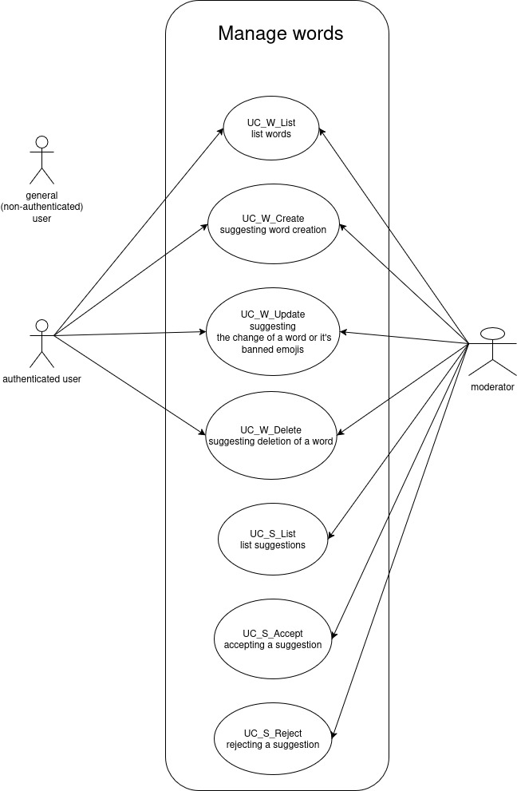
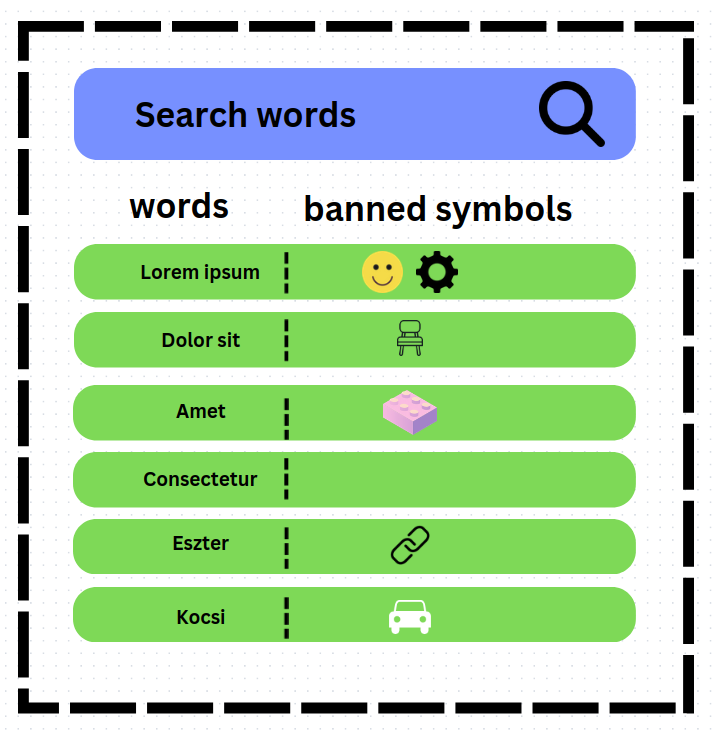

= Szavak kezelése - Funkcionális modell

====== készítették: Kocsis Álkos, Molnár Dávid, Bieleczki Gergő Péter
== Leírás

A nem bejeletkezett felhasználó is meg tudja nézni az adatbázisban eltárolt szavakat.

A bejelentkezett felhasználó tehet javaslatot új szó létrehozására illetve meglévő szavak módosítására és törlésére.

== Használati esetek

=== Használati eset diagram

=== Használati esetek rövid leírása
[cols="1h,4"]
|===
| Használati eset
| Szavak listázása

| Azonosító
| UC_W_List

| Kiváltó esemény
| A felhasználó listázni kívánja a szavakat

| Felhasználók
| Általános felhasználó, Bejelentkezett felhasználó, Moderátor

| Elsődleges lefutás
|
1. A felhasználó a szavak listázása menüpontra kattint,

2. A rendszerben kiválogatásra kerülnek a szavak

| Kivételek és alternatívák
| -

| Utófeltétel
| A rendszerben a szavak listája előállt

| Eredmény
| A felhasználó látja a szavak listáját, kiválaszthat egyet közülük.

| Használati eset realizáció
| Technikai modell

|===

[cols="1h,4"]
|===
| Használati eset
| Új szó javaslata

| Azonosító
| UC_W_Create

| Kiváltó esemény
| A bejelentkezett felhasználó létre szeretne hozni egy új szót

| Felhasználók
| Bejelentkezett felhasználó, Moderátor

| Elsődleges lefutás
|
1. A felhasználó a javaslat tétele menüpontra kattint

2. A felhaszáló a felugró ablakban kiválasztja az új szó létrehozását

3. A felhasználó beírja az új szót, a hozzá tartozó tiltott szimbólumokat, és opcionálisan egy rövid indoklást a szó létrehozására

4. A felhasználó a javaslat küldése gombra kattint

5. A javaslat eltárolásra kerül az adatbázisban, majd a moderátorok azt elfogadhatják vagy elutasíthatják.

| Kivételek és alternatívák
| -

| Utófeltétel
| Az adatbázisban rögzül a javaslat

| Eredmény
| A moderátorok láthatják a javaslatot, majd elfogadhatják illetve elutasíthatják azt.

| Használati eset realizáció
| Technikai modell

|===

[cols="1h,4"]
|===
| Használati eset
| Javaslat szó, vagy az ahhoz tartozó tiltott szimbólumok módosítására

| Azonosító
| UC_W_Update

| Kiváltó esemény
| A bejelentkezett felhasználó módosítani szeretne egy szót vagy az ahhoz tartozó tiltott szimbólumokat.

| Felhasználók
| Bejelentkezett felhasználó, Moderátor

| Elsődleges lefutás
|
1. A felhasználó a javaslat tétele menüpontra kattint

2. A felhaszáló a felugró ablakban kiválasztja a szó módosítását

3. A felhasználó kiválasztja a már meglévő szavak közül a módosítani kívánt szót, beírja az új szót és/vagy a hozzá tartozó tiltott szimbólumokat, valamint egy rövid indoklást a szó és/vagy a tiltott szimbólumok módosítására

4. A felhasználó a javaslat küldése gombra kattint

5. A javaslat eltárolásra kerül az adatbázisban, majd a moderátorok azt elfogadhatják vagy elutasíthatják.

| Kivételek és alternatívák
| -

| Utófeltétel
| Az adatbázisban rögzül a javaslat

| Eredmény
| A moderátorok láthatják a javaslatot, majd elfogadhatják illetve elutasíthatják azt.

| Használati eset realizáció
| Technikai modell

|===

[cols="1h,4"]
|===
| Használati eset
| Javaslat szó törlésére

| Azonosító
| UC_W_Delete

| Kiváltó esemény
| A bejelentkezett felhasználó törölni szeretne egy szót.

| Felhasználók
| Bejelentkezett felhasználó, Moderátor

| Elsődleges lefutás
|
1. A felhasználó a javaslat tétele menüpontra kattint

2. A felhaszáló a felugró ablakban kiválasztja a szó törlését

3. A felhasználó kiválasztja a már meglévő szavak közül a törölni kívánt szót, valamint egy rövid indoklást a szó törlésére

4. A felhasználó a javaslat küldése gombra kattint

5. A javaslat eltárolásra kerül az adatbázisban, majd a moderátorok azt elfogadhatják vagy elutasíthatják.

| Kivételek és alternatívák
| -

| Utófeltétel
| Az adatbázisban rögzül a javaslat

| Eredmény
| A moderátorok láthatják a javaslatot, majd elfogadhatják illetve elutasíthatják azt.

| Használati eset realizáció
| Technikai modell

|===

[cols="1h,4"]
|===
| Használati eset
| Javaslatok listázása

| Azonosító
| UC_S_List

| Kiváltó esemény
| A moderátor listázni kívánja a javaslatokat

| Felhasználók
| Moderátor

| Elsődleges lefutás
|
1. A moderátor a javaslatok menüpontra kattint,

2. A rendszerben kiválogatásra kerülnek a javaslatok

| Kivételek és alternatívák
| -

| Utófeltétel
| A rendszerben a javaslatok listája előállt

| Eredmény
| A moderátor látja a javaslatok listáját, melyeket elfogadhat, illetve elutasíthat.

| Használati eset realizáció
| Technikai modell

|===

[cols="1h,4"]
|===
| Használati eset
| Javaslatok elfogadása

| Azonosító
| UC_S_Accept

| Kiváltó esemény
| A moderátor jóvá akar hagyni egy javaslatot

| Felhasználók
| Moderátor

| Elsődleges lefutás
|
1. A moderátor az általa kiválasztott javaslat mellett található 'elfogadás' ikonra kattint,

2. A rendszerben a javaslat típusának megfelelő esemény megy végbe (create,update,delete).

| Kivételek és alternatívák
| -

| Utófeltétel
| A rendszerben létrejött, módosult vagy törlődött egy szó.

| Eredmény
| A szavak listázásakor megjelenik az új vagy a módosított szó, vagy már nem jelenik meg a törölt szó.

| Használati eset realizáció
| Technikai modell

|===

[cols="1h,4"]
|===
| Használati eset
| Javaslatok elutasítása

| Azonosító
| UC_S_Reject

| Kiváltó esemény
| A moderátor el akar utasítani egy javaslatot

| Felhasználók
| Moderátor

| Elsődleges lefutás
|
1. A moderátor az általa kiválasztott javaslat mellett található 'elutasítás' ikonra kattint,

2. A rendszerben eltűnik a javaslatok közül az elutasított javaslat.

| Kivételek és alternatívák
| -

| Utófeltétel
| A rendszerben eltűnik a javaslatok közül az elutasított javaslat.

| Eredmény
| A szavak listázásakor minden a régi marad.

| Használati eset realizáció
| Technikai modell

|===

== Jogosultságok

[cols="1,1,1"]
|===
| Használati eset | Jogosultság | Szerepkörök

| Szavak listázása
| WORD_LIST
| Általános felhasználó, Bejelentkezett felhasználó, Moderátor

| Új szó javaslata
| WORD_CREATE
| Bejelentkezett felhasználó, Moderátor

| Javaslat szó, vagy az ahhoz tartozó tiltott szimbólumok módosítására
| WORD_UPDATE
| Bejelentkezett felhasználó, Moderátor

| Javaslat szó törlésére
| WORD_DELETE
| Bejelentkezett felhasználó, Moderátor

| Javaslatok listázása
| SUGGESTION_LIST
| Moderátor

| Javaslatok elfogadása
| SUGGESTION_ACCEPT
| Moderátor

| Javaslatok elutasítása
| SUGGESTION_REJECT
| Moderátor

|===

== Felületi terv

=== Szavak listázása felület

==== Arculat

==== A felületen lévő mezők

[cols="1,1,1,1"]

|===
| Név | Típus | Kötelező? | Szerkeszthető?

| Keresés
| Szöveges input mező
| N
| I

| Szavak fejléc
| Szöveg mező
| N
| N

| Tiltott ikonok fejléc
| Szöveges mező
| N
| N

| Szó listaelem
| Gomb
| N
| N

| Szó
| Szöveges mező
| N
| N

| Ikonok
| Szöveges mező
| N
| N

|===

==== A felületről elérhető műveletek
[cols="1,1,1"]
|===
| Esemény | Leírás | Jogosultság

| Szó listaelemre kattintás
| A felugró ablakban kiválasztásra kerül a szó. A javaslat tétele ablakokban a szó adatait láthatjuk.
| WORD_LIST
|===

=== Új szó javaslata felület

==== Arculat
image::../static/frontend_plans/create_word_suggest.png[Új szó javaslata arculati terv]

==== A felületen lévő mezők

[cols="1,1,1,1"]

|===
| Név | Típus | Kötelező? | Szerkeszthető?

| Szó
| Szöveges input mező
| I
| I

| Szimbólum
| Input mező
| I
| I

| Indoklás
| Szöveges input mező
| N
| I

|===

==== A felületről elérhető műveletek

[cols="1,1,1"]
|===
| Esemény | Leírás | Jogosultság

| A Send gombra kattintás
| Az új szó bevezetésére való javaslat elküldésre kerül. A moderátorok láthatják a javaslatot a javaslatok listázásakor.
| WORD_CREATE
|===

=== Szavak módosítására javaslat felület

==== Arculat

==== A felületen lévő mezők

[cols="1,1,1,1"]

|===
| Név | Típus | Kötelező? | Szerkeszthető?

| Módosítani kívánt szó az adatbázisból kiválasztva
| Objektum
| I
| I

| Új szó
| Szöveges input mező
| Igen, de automatikusan kitölttődik szó választása után
| I

| Szimbólum
| Input mező
| Igen, de automatikusan kitölttődik szó választása után
| I

| Indoklás
| Szöveges input mező
| N
| I

|===

==== A felületről elérhető műveletek

[cols="1,1,1"]
|===
| Esemény | Leírás | Jogosultság

| A Send gombra kattintás
| A szó módosítására való javaslat elküldésre kerül. A moderátorok láthatják a javaslatot a javaslatok listázásakor.
| WORD_UPDATE
|===

=== Szavak törlésére javaslat felület

==== Arculat
image::../static/frontend_plans/delete_word_suggest.png[Meglévő szó törlésének javaslata arculati terv]

==== A felületen lévő mezők

[cols="1,1,1,1"]

|===
| Név | Típus | Kötelező? | Szerkeszthető?

| Törölni kívánt szó az adatbázisból kiválasztva
| Objektum
| Igen, de automatikusan kitölttődik szó választása után
| I

| Indoklás
| Szöveges input mező
| N
| I

|===

==== A felületről elérhető műveletek

[cols="1,1,1"]
|===
| Esemény | Leírás | Jogosultság

| A Send gombra kattintás
| A szó törlésére való javaslat elküldésre kerül. A moderátorok láthatják a javaslatot a javaslatok listázásakor.
| WORD_DELETE
|===

=== Javaslatok listázása felület

A felületen megjelenő kék, zöld és piros dobozok valójában mind egy objektumot reprezentálnak, a "suggestion" azaz javaslat objektumot. A kék változtatást, a zöld létrehozást, a piros pedig törlést jelent. Ezeken az objektumokon 2 közös műveletet értelmezünk, az elfogadást és az elutasítást.

==== Arculat
image::../static/frontend_plans/list_suggestions.png[javaslatok megtekintése arculati terv]

==== A felületen lévő mezők

[cols="1,1,1,1"]

|===
| Név | Típus | Kötelező? | Szerkeszthető?

| Fiók
| Gomb
| I
| N

| Vissza a játékba
| Gomb
| I
| N

| Javaslat tétele
| Gomb
| N
| N

| Jelentkezés moderátornak
| Gomb
| N
| N

| Eredeti szó
| Szöveges mező
| N
| N

| Új szó
| Szöveges mező
| N
| N

| Eredeti tiltott ikonok
| Szöveges mező
| N
| N

| Új tiltott ikonok
| Szöveges mező
| N
| N

| Indoklás
| Szöveges mező
| N
| N

| Jóváhagyás
| Gomb
| N
| N

| Elutasítás
| Gomb
| N
| N

|===

==== A felületről elérhető műveletek

[cols="1,1,1"]
|===
| Esemény | Leírás | Jogosultság

| A "play" gombra kattintás
| Visszakerülünk a főoldalra, ahol játszhatunk tovább.
|

| "Javaslat tétele gombra" kattintás
| Megjelenik az új szó javaslata felület. Javaslatot tehetünk Új szó tételére.
| WORD_CREATE

| "Jelentkezés Moderátornak" gombra kattintás
| Megjelenik a "jelentkezés moderátornak" felugró ablak
| SUGGESTION_LIST

| Az "Accept" (pipa) gombra kattintás
| A javaslat elfogadásra kerül. Létrehozási javaslat esetén az új szó megjelenik a rendszerben, módosítási javaslat esetén a módosított szó lesz elérhető a rendszerben, az új tiltott ikonokkal, illetve törlési javaslat esetén a szó törlődik a rendszerből.
| SUGGESTION_ACCEPT

| A "Reject" ( X ) gombra kattintás
| A javaslat elutasításra kerül. A rendszerben minden marad a régi.
| SUGGESTION_REJECT

| A "name" gombra kattintás
| Megjelenik a "login" felugró ablak és fiókot válthatunk ( illetve bejelentkezhetünk ha eddig nem tettük meg ).
|

|===

link:../functional-models.adoc[Vissza]