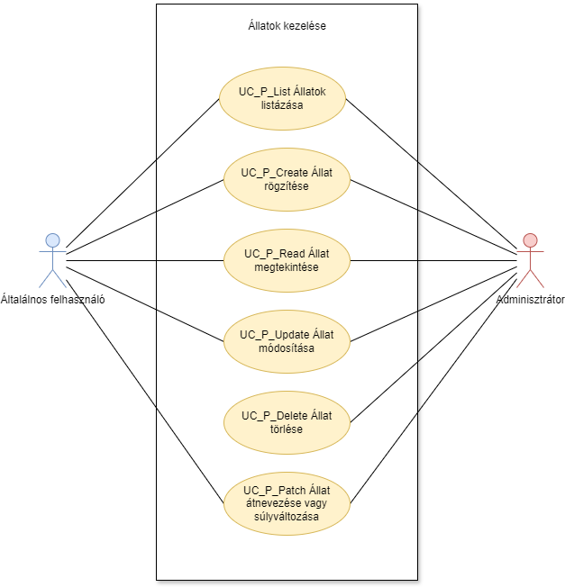

= Állatok kezelése - Funkcionális modell

== Lerírás

A bejelentkezett felhasználó tudja listázni, megtekinteni, módosítani és törölni a rendszerben az állatokat

== Használati esetek

=== Használati eset diagram

=== Használati esetek rövid leírása
[cols="1h,4"]
|===
| Használati eset
| Állatok listázása

| Azonosító
| UC_P_List

| Kiváltó esemény
| A felhasználó listázni kívánja az állatokat

| Felhasználók
| Általános felhasználó, Adminisztrátor

| Elsődleges lefutás
|
1. A felhasználó az Állatok listázása menüpontra kattint,

2. A rendszerben kiválogatásra kerülnek az állatok

| Kivételek és alternatívák
| -

| Utófeltétel
| A rendszerben az állatok listája előállt

| Eredmény
| A felhasználó látja az állatok listáját, kiválaszthat egyet közülük.

| Használati eset realizáció
| Technikai modell

|===

== Jogosultságok

készül...

== Felületi terv

=== Arculat

=== A felületen lévő mezők

=== A felületről elérhető műveletek

link:../functional-models.adoc[Vissza]