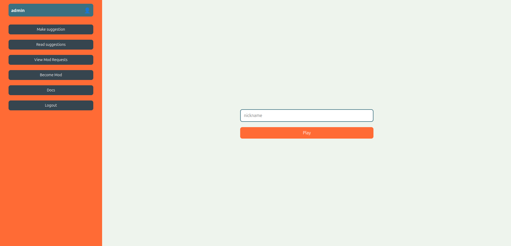
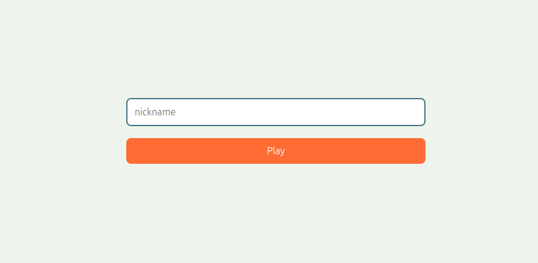
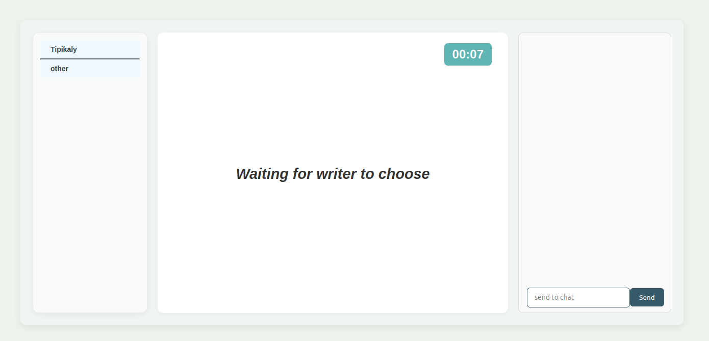
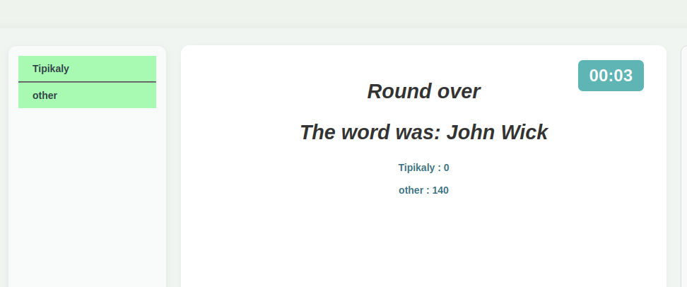
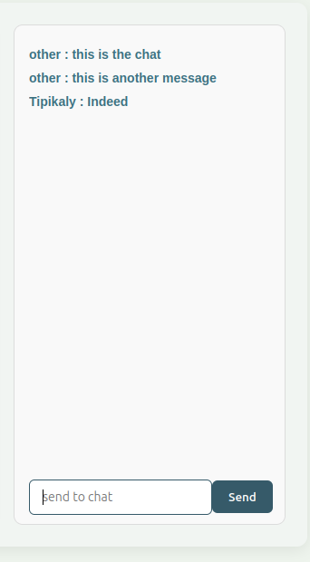

= User Documentation

== Introduction

Welcome to the Actimoji Game! This guide helps you, as a user, navigate the system, understand the core features, and make the most out of your gameplay experience—whether you're here just for fun or ready to contribute words and moderate content.

== Getting Started

=== Accessing the Application

You can access the game through your web browser or mobile device. No installation is required.

=== Main page

This is the main page, which you will see when you want to play the game.

=== Creating an Account

1. Click on the “Sign up” button.
2. Fill in your email address, username, and password.
3. Submit the form to create your account.
4. After registration, log in to start using the features or if you just want to play, you don't need to have an account.

=== Logging into your account
1. Click on the Login button
2. Write you username and your password
3. Press Submit button to login

There are different roles in the system, each with different capabilities:

|===
| Role | Capabilities

| General User | Play the game.
| Authenticated User | All General User features, plus: propose new words, request moderator role.
| Moderator | All Authenticated User features, plus: review and approve/reject word proposals and moderator requests.
|===

== Playing the Game

1. Join or create a game room.

2. Wait for the game to begin once enough players have joined.

3. Start the game
4. If you are a writer, choose a word you want to write with emojis

5. If you are a guesser, guess the word based on the emoji clues.

6. Points are awarded based on how quickly you guessed the prompt

=== Chat Feature

- You can chat with other players during the game.
- This is also where you will have to type your guesses.

== Word Proposals

=== Making a new suggestion

1. Navigate to the “Make suggestion” menu.
2. If you want to create a new word, enter the word, emojis (symbols), and an optional reason.
3. Press the Create button to submit your proposal for moderator review.

=== Modifying a Word

1. Select an existing word from the database.
2. Update the word or its associated emojis.
3. Add an optional reason.
4. Press the modify button to submit your changes for review.

=== Deleting a Word

1. Select the word to delete.
2. You have to provide a reason.
3. Press the delete button to submit the deletion request.

=== Selecting the word

To select the word you want to perform the action on, click the `Select Old Word` button. Then the `List words` panel will open up.

To select the word, click on it in the panel that opens up. You can also navigate to the next and previous page to find more words. Click on the close button to close the panel without choosing the word.

=== The Emoji keyboard

We made an emoji keyboard to assist you with some tasks, such as:

- when typing in banned icons for a suggestion:

- when you're describing a word ( in-game )

Just start typing the emoji and it will show you only the emojis that fit your keywords:

To choose an emoji, click on it, or alternatively, press alt+enter

To delete the last emoji, either click the delete button, or press alt+backspace

=== Applying for moderator
1. Press the become mod button
2. Write a reason why you want to be a moderator

== Moderator Actions

As a moderator, you can:

- View the list of all proposals.
- Accept or reject proposals for:
- Adding a new word
- Modifying an existing word
- Deleting a word
- Review moderator applications

== Frequently Asked Questions (FAQ)

=== Do I need an account to play?
No. You can play as a guest, but you’ll need to register to propose words or become a moderator.

=== How do I become a moderator?
Submit a request via the “Become mod” option. Moderators will review your request.

=== How are scores calculated?
Scores depend on how quickly and accurately you guess words.

link:README.adoc[Back to Main Documentation]
